# VoltEdge Electronics: Post-Pandemic Sales Recovery & Customer Insights

## 1. Project Background

### About VoltEdge Electronics
VoltEdge Electronics is an emerging global retailer in the electronics industry, competing with well-established brands. The company operates both online and through physical stores, offering a diverse range of consumer and high-end technology products. To scale its operations and optimize sales strategies,  VoltEdge is leveraging data analytics to better understand sales performance, customer behavior and market trends.

### Project Objective
This analysis focuses on understanding sales trends, customer behavior and market shifts to improve revenue growth and customer retention. 

Key questions include:
- How have sales trends evolved from 2016 to 2020 (pre-pandemic vs. pandemic shifts)?
- What drives customer purchasing decisions? (demographics, store type, product preferences)
- How can VoltEdge increase repeat customer retention?
- What role do exchange rates play in international sales?

To achieve these goals, this project involves collaborating with the Sales, Marketing, Finance and Store Operations teams to align insights with revenue growth, customer engagement and market expansion strategies.

### Scope & Business Impact
By analyzing sales, customer segmentation, product trends and store performance, this project will provide insights to:
- Identify top-performing products & optimize pricing strategies.
- Improve marketing efforts to retain loyal customers.
- Enhance international expansion by understanding exchange rate impacts.
- Maximize store efficiency and online vs. offline sales performance.

Through this data-driven approach, VoltEdge aims to strengthen its market position, increase revenue and build a loyal customer base.

## 2. Executive Summary
The data analysis highlights key trends in customer behavior, product performance, and revenue distribution. Older customers (56+) are the primary revenue drivers, while younger demographics (18-25) exhibit strong purchase volume but remain price-sensitive. Loyalty retention declined significantly in 2020, with a shift toward one-time buyers, likely due to pandemic-driven shopping behavior. Product bundling remains an untapped opportunity, as most bundled purchases occurred only once. Additionally, regional spending trends vary, with the US dominating overall revenue, while France and Italy show unique gender-based differences in purchasing habits.

**Key Insights**
- Older customers (56+) generate the highest revenue, contributing over $2M in sales, while younger customers (18-25) have potential for growth despite lower spending.
- Minimal gender differences in overall spending, except in France and Italy, where female customers significantly outspend males.
- Computers & Cellphones are the top revenue-generating categories, with black and white computers selling the most.
- Customer loyalty dropped sharply in 2020, with repeat buyers decreasing from 30% to 17%, and loyal buyers disappearing entirely.
- Product bundling is underutilized, as most bundled items were purchased only once, indicating a missed opportunity for upselling.
- Regional differences are significant: the US leads in total spending, Germany has a balanced age distribution and the UK and Canada rely on older customers.

**Strategic Recommendations**
- Strengthen customer retention by introducing loyalty programs, personalized engagement and targeted marketing for repeat buyers.
- Leverage bundling strategies to encourage multi-item purchases, especially within Computers, Cellphones and Accessories.
- Optimize regional marketing efforts, tailoring promotions for high-spending demographics (e.g., senior-focused campaigns in Canada/UK, female-driven promotions in France/Italy).
- Improve pricing strategies for younger customers (18-25) to convert high purchase volume into higher revenue.
- Expand digital engagement initiatives, capitalizing on the pandemic-driven e-commerce shift to enhance long-term online sales growth.

## 3. Dataset Overview
The dataset consists of five interconnected tables, each serving a distinct analytical purpose. The data in these tables represents the raw, unprocessed version before any cleaning or transformation was applied during the analysis.

**Dataset Structure**
- **Customers**: Contains demographic details to segment buyers based on age, gender, and location.

- **Sales**: Tracks individual transactions, including purchase quantities and revenue, forming the core of sales analysis.

- **Products**: Provides product attributes like category, brand, and pricing, supporting performance and bundling insights.

- **Stores**: Links transactions to physical or online locations, enabling regional and store-level analysis.

- **Exchange Rates**: Standardizes revenue across currencies to ensure accurate international comparisons.

**Data Relationships**

These tables are connected through unique identifiers such as CustomerKey, ProductKey, and StoreKey, enabling a structured analysis of who buys what, from where, and at what price. A diagram below visualizes these relationships, highlighting key columns and connections:

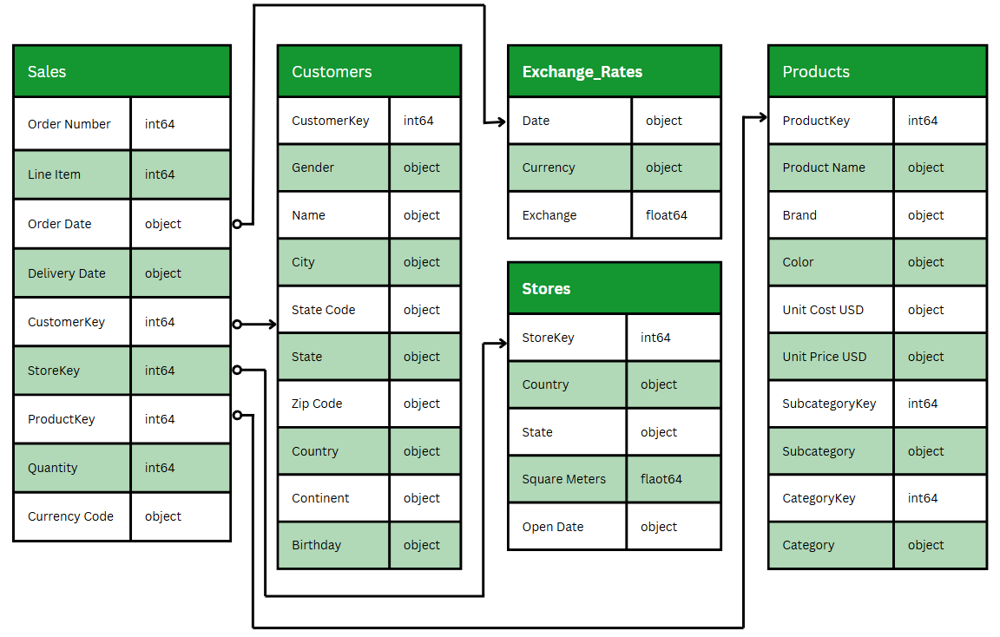


## 4. Insights Deep-Dive
## 4.1. Section 1: Sales & Revenue Trends
### 4.1.1. Steady Growth Until 2019, Sharp Shift in 2020: Revenue Trends by Product Category (2016-2020)
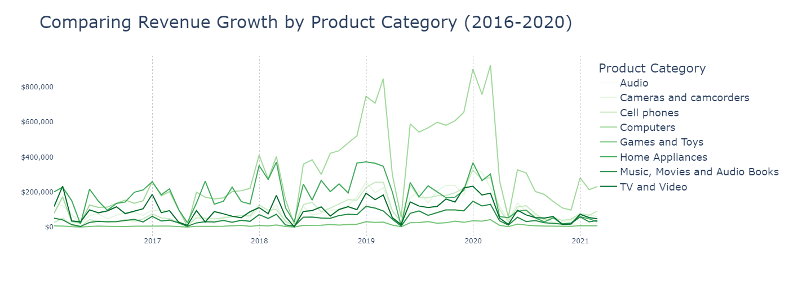

**General Trends (Market Evolution)**: 
- In 2016, all product categories had similar revenue levels, but by 2017, Computers & Home Appliances dominated, doubling the revenue of other categories.
- By 2018, Computers clearly outpaced Home Appliances and kept its lead through 2020, even during major market shifts.

**Seasonal & Cyclical Trends (Consumer Buying Behavior)**:
- Most categories follow a cyclical pattern, with spikes in December, February, and May. December spikes might be a result of holiday shopping, Black Friday and Christmas sales. February spikes might be a result of new product launches & post-holiday spending. May spikes may be a result of mid-year promotions & product refresh cycles.
- Revenue drops close to zero every April, then rebounds in May.
Likely due to financial year-end slowdowns, inventory resets, and delayed consumer spending.

**Notable Category-Specific Trends**:
- **Computers** → The highest revenue generator since 2018, peaking at $925K in Feb 2020. Despite an April dip (as expected), it still recovered to $327K in May 2020, double its 2016 revenue levels.

- **Home Appliances** → Competed closely with Computers until 2018, but its growth plateaued afterward. By April 2020, it was outpaced by Cellphones & Cameras.

- **Cellphones and Cameras & Camcorders** → Steady growth, reaching similar revenue levels as Home Appliances by 2019.

- **TV & Video** → Initially among the top categories in 2016 but fell behind Cellphones & Cameras by 2019, struggling to keep up.

- **Games & Toys** → Always the lowest revenue contributor, but revenue steadily increased from 2016 to 2019 before declining again in 2020.

**2019-2020 Pandemic Impact & Market Shifts**:
- April 2020 saw the steepest drop across all categories, likely due to supply chain disruptions & consumer uncertainty.
- By mid-2020, all categories (except Computers) dropped to less than half their 2016 revenue.
- Computers remained resilient, still generating double the revenue of any other category in 2020, likely due to remote work & online learning demand.
- TV & Video declined sharply in 2020, possibly due to shifting consumer priorities.


### 4.1.2. The Rise of E-Commerce: Online vs. Physical Store Revenue Shift (2016-2020)
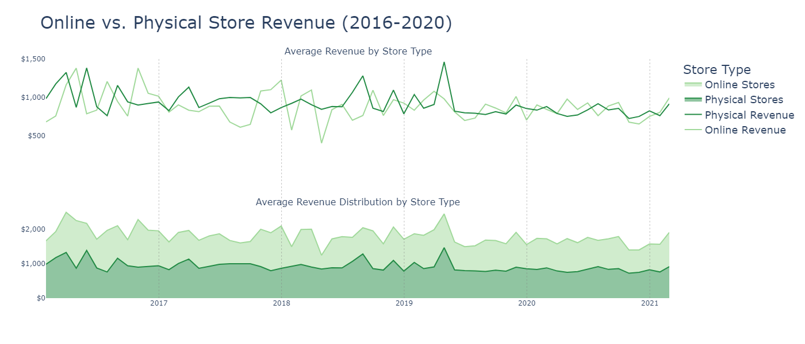

**Overall Revenue Trends: Online vs. Physical Stores**:
- Online and physical stores generated similar average revenue levels throughout 2016-2020, indicating that both channels were equally strong in terms of sales contribution.
- However, online and physical stores did not always peak at the same time, with online store revenue lagging slightly behind physical store revenue in early years (2016-2017).
- From 2018 onward, the revenue trends of online and physical stores began aligning more closely, suggesting a shift in consumer behavior towards more synchronized purchasing patterns across both channels.

**2016-2017: Volatile Trends & Early Market Growth**:
- In 2016, physical store revenue peaked earlier (March, May, August), while online store revenue peaked slightly later (April, July, October), indicating that consumers were still favoring in-store purchases first, before shifting online.
- Both store types experienced frequent sharp spikes and drops, with revenue falling to $0.8K in April and September for online and July for physical stores, showing high volatility in early years.
- By 2017, volatility decreased, and revenue movements became smoother, particularly for physical stores.
- Online store growth was slower in early 2017, with smaller revenue peaks compared to 2016.
- December 2017 was the strongest month for online sales, reaching $1.2K, confirming a growing shift towards e-commerce during the holiday season.

**2018-2019: Online Store Gains & Peak Performance for Physical Stores**:
- 2018 showed a clear pattern of January revenue drops across both store types, followed by sharp rebounds.
- The worst overall drop occurred in April 2018 for online stores ($0.4K), suggesting a slowdown in consumer spending at the start of Q2.
- Physical store revenue peaked in August 2018 at $1.3K, marking its strongest month of the year.
- 2019 marked the highest-ever peak for physical stores, reaching $1.5K in April—the largest revenue spike across the entire dataset.
- Revenue fluctuations became smaller in 2019, with both store types stabilizing around $1K on average, except for the April 2019 peak.

**2020: Pandemic Impact & Revenue Convergence**
- The gap between online and physical stores disappeared in 2020, with both store types almost overlapping in revenue trends.
- Revenue declined significantly, fluctuating between $0.6K and just under $1K, a significant drop compared to previous years.
- Physical store revenue declined more sharply, dropping further in February 2020 and remaining low through May 2020, showing the impact of lockdowns & reduced foot traffic.
- Online stores showed resilience, maintaining small peaks in January, April, June, and September 2020, suggesting continued consumer demand despite economic uncertainty.
- By late 2020, both store types trended downward, with physical store revenue declining steadily from July to October 2020, before a slight recovery approaching 2021.

**Average Revenue Distribution: Online vs. Physical Stores (2016-2020)**
- Online and physical stores contributed nearly equal shares of revenue from 2016-2020, reinforcing their equal importance in the business.
- Physical stores held a slightly larger revenue share in 2017 and 2018, but the difference was minor and barely noticeable, indicating that online store sales were catching up rapidly.


### 4.1.3. How Currency Fluctuations Affected Global Revenue: Exchange Rate & Sales Trends (2016-2020)
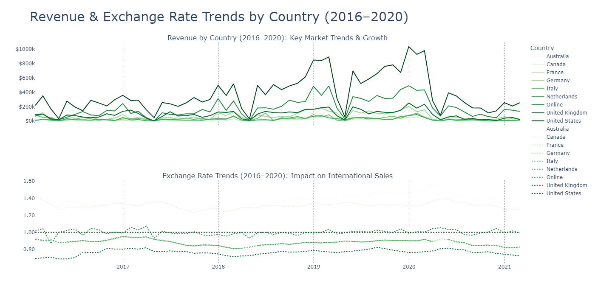

**Revenue Trends by Country (2016–2020)**

- All countries follow the same overall business cycle, with peaks and dips aligning across categories, suggesting that global demand patterns drive revenue movements.
 - The U.S. and Online Sales are the top revenue generators, both experiencing rapid growth from 2018 onward. The U.S. nearly tripled revenue, while Online doubled revenue by 2019 compared to 2016.
 - UK & Germany had similar revenue trends, but Germany followed cyclical patterns more closely, while the UK often strayed, particularly avoiding the January dip that other countries experienced (except in 2020).
 - Canada, Germany, and the UK all converged in revenue from 2018 onward, stabilizing at similar levels.
 - Smaller markets (Australia, France, Italy, Netherlands) had revenue patterns that fluctuated but remained far below top-performing countries, making their trends harder to spot without zooming in.
 - April 2020 saw a dramatic revenue collapse for all countries, bringing revenue back to 2016 levels due to pandemic-driven economic shocks.
 - By late 2020, major markets (Australia, Canada, France, Germany, Italy, Netherlands, UK) converged to similar revenue levels, signaling a flattening of global revenue differences post-pandemic.

**Exchange Rate Trends & Their Business Impact (2016–2020)**
- Australia & Canada had the strongest exchange rates (~1.3), but diverged in 2018. By 2020, Australia’s exchange rate peaked at 1.59, significantly separating from Canada (1.37).
 - The U.S. remained steady at 1.0, while Online closely followed it, fluctuating slightly above and below.
 - Europe (France, Germany, Italy, Netherlands) had highly synchronized exchange rate movements, staying between 0.8 and 0.94 but dropping to 0.83 by 2020.
 - The UK had the weakest exchange rate, fluctuating between 0.7 and 0.8, always trailing Europe.
 - The UK briefly deviated from Europe’s trend between March 2019 and April 2020, rising to 0.82 while Europe remained stable at ~0.89.


### 4.1.4. Where Are Our Most Profitable Stores? Country-Level Store & Customer Metrics (2020)
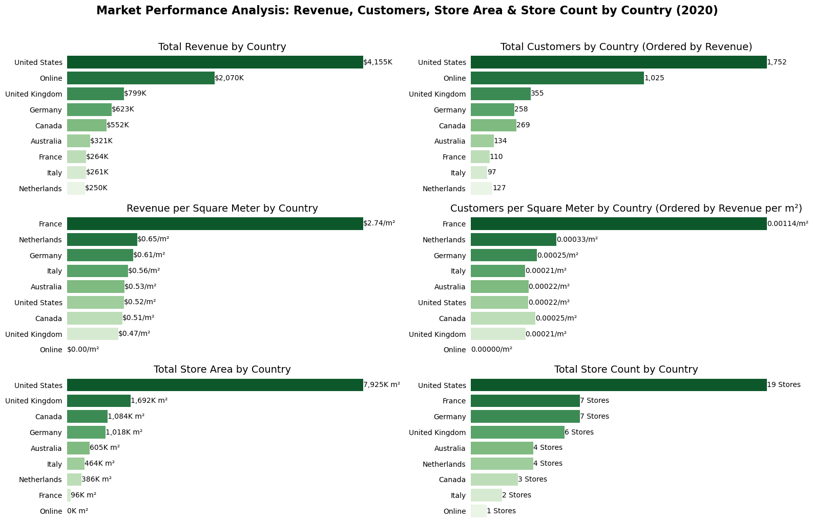

**Total Revenue by Country**
- The U.S. is the dominant market, generating $4.155M, nearly twice the revenue of Online ($2.07M) and more than five times the UK ($799K), the next highest country.
 - Online is the second-largest revenue driver, outperforming all individual physical markets except the U.S.
 - The UK, Germany, and Canada are mid-tier markets, contributing $500K–$800K in total revenue.
 - France, Italy, and the Netherlands are underperforming markets (<$300K revenue), indicating weaker market penetration.

**Total Customers by Country**
- The U.S. leads in customer base (1,752 customers), followed by Online (1,025).
 - The UK (355 customers) is the strongest market outside the U.S. & Online.
 - France, Italy, and the Netherlands have the lowest customer counts (<150 customers each), indicating poor customer reach and engagement.

**Revenue per Square Meter by Country**
- France has the highest revenue per square meter ($2.74), meaning it generates the most revenue relative to store size.
 - The Netherlands, Germany, and Italy also have decent efficiency ($0.65–$0.56), while larger markets like the U.S. and UK have lower efficiency ($0.52–$0.74).
 - Canada and Australia have the lowest revenue per square meter (~$0.50), indicating inefficient use of store space.

**Customers per Square Meter by Country**
- France has the highest customer density (0.00114 customers per sqm), followed by the Netherlands (0.00033).
 - Larger markets like the U.S., UK, and Canada have significantly lower customer densities (~0.00021–0.00025).
 - Germany and Italy have relatively low customer density, despite having strong revenue per sqm.

**Total Store Area & Store Count by Country**
- The U.S. has the largest store footprint (7,925 sqm) and the most stores (19), but low revenue per square meter.
 - France has the highest store efficiency despite having only 7 stores and the smallest total store area (96 sqm).
 - Countries with a large number of stores but moderate revenue include Germany (7 stores, $623K revenue) and the UK (6 stores, $799K revenue).
 - Canada has only 3 stores but generates more revenue than Australia (which has 4 stores), suggesting better store utilization.


## 4.2. Section 2: Customer Segmentation & Buying Patterns
### 4.2.1. Who Spends the Most? Revenue & Purchase Volume Breakdown by Age & Gender (2020)
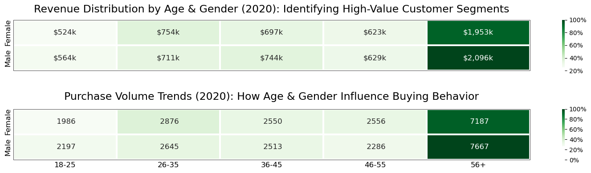
 - **Older Customers (56+) Drive the Most Revenue & Sales Volume**:
Customers aged 56+ contribute the highest revenue ($2.096M for males, $1.953M for females) and highest purchase volume (7667 for males, 7187 for females). This age group consistently spends the most across all product categories.

- **Younger Age Groups (18-25)**: Spend the Least but Have Growth Potential
Revenue from 18-25-year-olds is the lowest across all age groups, despite a decent purchase volume. This suggests they are price-sensitive and may prefer lower-cost products.

- **Gender Differences Are Minimal in Revenue & Purchase Volume**:
Males spend slightly more than females in most categories, but the gap is not significant. Both genders show similar buying patterns across product categories.

<br>

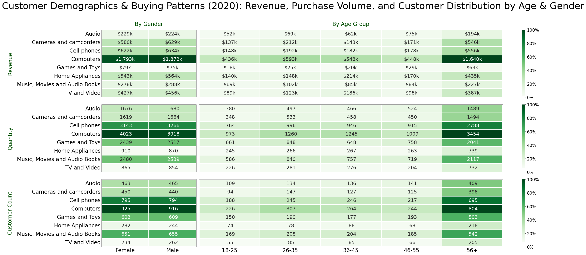

**Revenue & Purchase Volume Trends by Age & Gender**:
- Older customers (56+) are the most valuable segment.
They generate the highest revenue ($2.1M for males, $1.95M for females).
They also have the highest purchase volume (7,667 for males, 7,187 for females).
- Younger age groups (18-25) spend the least but show potential.
Their purchase volume is relatively high, but revenue is low, suggesting price sensitivity.
- Minimal gender differences in spending behavior.
Males spend slightly more, but the gap is not significant, meaning gender-specific marketing may not be necessary.

**Revenue & Customer Distribution by Product Category & Demographics**:
- Computers are the top revenue-generating category for both males ($1.87M) and females ($1.79M).
 - Cellphones & Cameras follow at ~40% of Computer revenue, with Home Appliances & TV & Video around 30%.
 - Games & Toys perform the worst across all demographics (~5% of Computer revenue).
- Older customers (56+) dominate revenue across all categories.
Computers: 56+ contributes 100% of the highest revenue mark.
Cellphones, Cameras, Home Appliances, and TV & Video also perform best in the 56+ age group.

**Quantity Purchased vs. Revenue Differences**
- Cellphones have high quantity sales but generate less revenue per unit.
Suggests that lower-priced models or discounts are driving sales.
 - Computers have the highest quantity sold & highest revenue.
 - Games & Toys, Music, Movies & Audiobooks have relatively high sales volume but low revenue.
Lower price points in these categories lead to lower revenue despite high customer engagement.

**Customer Count by Product Category & Demographics**
- Computers have the highest customer count, followed by Cellphones.
 - Games & Toys, Music, Movies & Audiobooks have a high customer count but low revenue per transaction.
 - Older customers (56+) drive the highest customer count across most categories.


### 4.2.2. Where Are Our Customers? Regional Spending & Demographic Trends (2020)
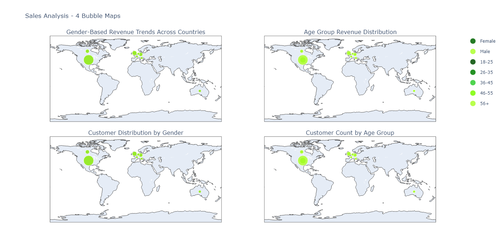

**Gender-Based Revenue & Customer Trends Across Countries**
- **Males and females contribute nearly equal revenue in most countries**:
For the US, there's only a 2.2% difference between male ($2.1M) and female customers ($2.054M).
For Germany, there's a minimal difference in revenue between male ($317K) and female customers ($306K).
Canada, Netherlands, and UK also show similar spending patterns between genders.

- **France & Italy stand out with females spending significantly more than males**:
For France, there's a 54% higher revenue generated from female customers ($160K) as compared to male customers ($104K).
For Italy, there's a 27% higher revenue generated from female customers ($146K) as compared to male customers ($115K).
Marketing & product selections may favor female consumers in these regions.

- **The US dominates gender-based spending, with nearly 7x the revenue of any other country**:
This suggests stronger purchasing power and higher product demand in the US.

- **Customer distribution mirrors revenue trends**:
US has the most customers (886 males, 866 females), aligning with its highest revenue.
France & Italy have more female customers, correlating with their higher female revenue.
Australia has more female customers (78 vs. 56) but females contribute more revenue ($184K vs. $137K).

**Age Group Revenue Trends Across Countries**
- **Older consumers (56+) generate the most revenue across all countries**:
For the US, older consumers generated $1.824M, which is 3.1x higher than age group 26-35 ($712K) and 3.9x higher than the age group 18-25 ($468K).
Canada, Germany, UK, and France follow the same trend.
Younger groups (18-25) contribute the lowest revenue everywhere.

- **The US dominates spending across all age groups**:
The age group 18-25 in the US alone generates more revenue ($468K) than all age groups in Australia ($321K combined).
Marketing should focus more on the US due to its purchasing power.

- **Germany has a strong 26-45 segment, unlike other European countries**:
Germany (26-45 total: $240K) has better spending in younger demographics than UK, France, and Italy which indicates a more balanced spending trend across age groups.

- **The UK and Canada have mid-tier spending but strong senior (56+) revenue**:
 For the UK, the age group 56+ generates 4x the revenue of the age group 18-25.
For Canada, the age group 56+ generates 2.7x the revenue of the age group 18-25.

**Age Group Customer Distribution Trends**
- **Customer distribution aligns with revenue trends where older consumers dominate**
For the US, the 56+ age group has 766 customers, which is 3.8x higher than 18-25 age group (198 customers).
Canada, UK, Germany, and France all follow the same pattern.

- **Germany and the UK have a balanced customer base across 26-55**:
Unlike Canada & Australia, which rely on 56+ buyers, Germany and the UK have strong 26-45 customer engagement.

- **Australia, France, and Italy have low customer counts overall**:
These regions need an aggressive customer acquisition strategy.

### 4.2.3. Did We Lose Our Loyal Customers? Repeat vs. One-Time Buyers Before & After the Pandemic (2019-2020)
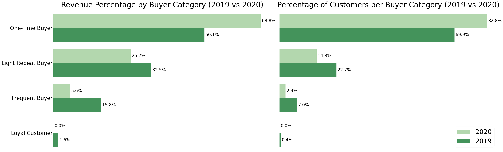

**Shift Towards One-Time Buyers in 2020**
- Revenue from One-Time Buyers increased from 50.1% (2019) to 68.8% (2020).
Customer count for One-Time Buyers increased from 69.9% (2019) to 82.8% (2020). This suggests that a large portion of 2020's revenue came from first-time or non-loyal customers.

- The likely reasons for this shift:
   - COVID-19 disrupted shopping behavior, leading to uncertain consumer spending.
  - Limited brand loyalty due to price sensitivity and changing priorities.
  - Increased online shopping from casual buyers trying new platforms.

**Repeat & Loyal Buyers Declined Significantly**
- Frequent Buyers dropped from 15.8% to 5.6% (Revenue) and 7% to 2.4% (Customer Count).

- Loyal Buyers completely disappeared (1.6% → 0.0% Revenue, 0.4% → 0.0% Customer Count). This means customers who used to make multiple purchases abandoned repeat buying in 2020.

- Possible reasons:
  - Economic uncertainty due to COVID-19 led to reduced discretionary spending.
  - Loss of brand loyalty as customers explored alternative options (competitor deals, new brands).
  - Limited engagement or retention efforts from the business (lack of targeted incentives for loyal customers).

**Light Repeat Buyers Also Declined**
- Revenue from Light Repeat Buyers decreased from 32.5% to 25.7%.
- Customer count for Light Repeat Buyers dropped from 22.7% to 14.8%.
This suggests that even moderately engaged customers reduced their purchases.


### 4.2.4. Who Are Our Most Loyal Customers? Repeat vs. One-Time Buyer Segmentation (2020)
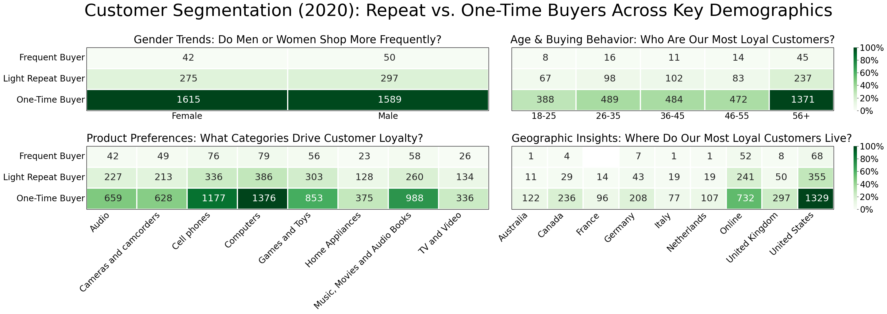

**One-Time Buyers Dominate Across All Segments**

- **Gender:**
  - Female customers make up 1615 of one-time buyers compared to only 42 frequent buyers (38x more one-time buyers).
  - Male customers likely follow a similar pattern, meaning repeat customer retention is a major issue.

- **Age Group:**
  - The 56+ segment has the highest number of one-time buyers (1371), followed by 26-45 age groups (~480-490 each).
  - Only 45 frequent buyers exist in the 56+ category, despite their high one-time buyer count.
  - Younger age groups (18-25, 26-35) also have high drop-off rates.

- **Product Category:**
  - Computers & Cellphones have the most one-time buyers (1376 & 1177) but relatively low frequent buyers (79 & 76).
  - Music, Movies & Audiobooks, Games & Toys, and Audio have similar retention issues where customers buy once and rarely return.
  - TV & Video has the lowest frequent buyer retention (26 frequent vs. 336 one-time).

- **Country:**
  - US has the highest one-time buyer count (1329) but only 68 frequent buyers.
  - Online purchases have a significant one-time buyer count (732), but only 52 frequent buyers.
  - Smaller markets like France, Italy, and the Netherlands have almost no repeat buyers.


## 4.3. Section 3: Product Performance & Bundling
### 4.3.1. Do Customers Prefer Certain Product Colors? Revenue & Sales Volume by Category and Color (2020)
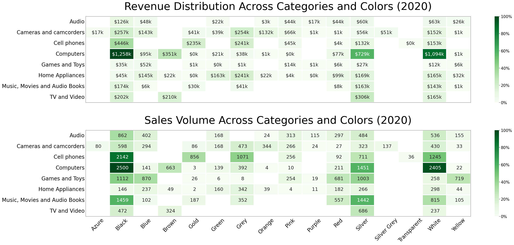

**Black & White Computers Generate the Highest Revenue & Sales Volume**
- Black Computers ($1.258M) generate the most revenue, followed by White Computers ($1.094M).
- Silver Computers ($729K) also perform well but significantly lower than Black & White.
- In sales quantity, Black Computers lead with 2500 units, followed by White Computers (2405 units).
- This means customers prefer classic, neutral-colored computers over more colorful alternatives.

**Cellphones and TV & Video See High Revenue in Brown & Silver Variants**
- Brown Cellphones ($446K) and Brown Computers ($351K) are top revenue drivers.
- Silver TV & Video ($306K) is the highest-earning color in that category.
- Black & Grey cellphones and cameras fall within the mid-tier revenue range (23%).

**Some Colors & Categories Struggle to Generate Revenue**
- Gold Computers, Green Games & Toys, Pink Computers, Purple Home Appliances, and Transparent Cellphones perform the worst (<$500).
- Bright or unconventional colors (e.g., purple, pink, transparent) are not as popular across most product categories.

**Sales Volume & Revenue Trends Are Aligned, but Some Colors Sell More Than They Earn**
- Black Cellphones sell well (2142 units) but don’t generate as much revenue as Computers.
- Black Music, Movies & Audiobooks have high volume but lower revenue, suggesting lower unit prices.
- Some low-revenue colors (e.g., Pink, Transparent, Green) also have low quantity, confirming low customer demand.


### 4.3.2. Which Brands Are Winning? Top-Performing Brands by Revenue & Sales Volume (2020)
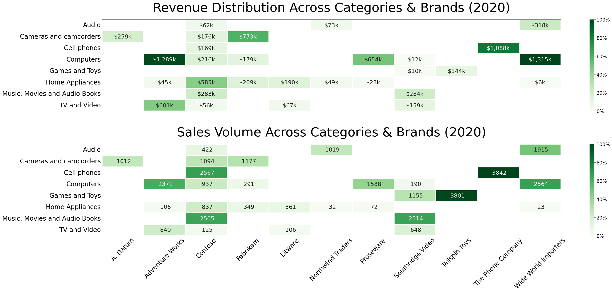

**Wide World Importers & Adventure Works Dominate High-Value Categories**
- Wide World Importers Computers ($1.315M) & Adventure Works Computers ($1.289M) generate the highest revenue.
- The Phone Company Cellphones ($1.088M) is the strongest-performing non-computer category.
- Fabrikam Cameras ($773K) is the highest-selling in the camera segment.
- These brands are clear market leaders, particularly in Computers & Cellphones.

**High Revenue ≠ High Quantity in Some Cases**
- The Phone Company Cellphones has the highest sales volume (3842 units) but generates lower revenue than Wide World Importers Computers.
- Tailspin Toys Games & Toys is the second-highest in quantity (3801 units) but doesn’t generate high revenue.
- This suggests high sales volume but lower price points for some brands, especially in Cellphones & Games & Toys.

**Mid-Tier Performers in Revenue & Quantity Suggest Room for Growth**
- Adventure Works TV & Video, Contoso Home Appliances, and Proseware Computers contribute around 47% of the highest revenue.
- These brands have strong potential but are still far from top-tier dominance.
- Contoso Music, Movies & Audiobooks and Southridge Video Music, Movies & Audiobooks (23%) suggest stable but niche demand.

**Some Brands Perform Poorly in Both Revenue & Sales Volume**
- Southridge Video Computers, Southridge Video Games & Toys and Wide World Importers Home Appliances contribute less than 1% of revenue & sales.
- Litware & Northwind Traders Home Appliances struggle to generate interest (under 3% in both metrics).
- Brands in TV & Video, Audio and Home Appliances tend to underperform compared to Computers & Cellphones.


### 4.3.3. What Do Customers Buy Together? Product Bundling Insights from Transaction Data
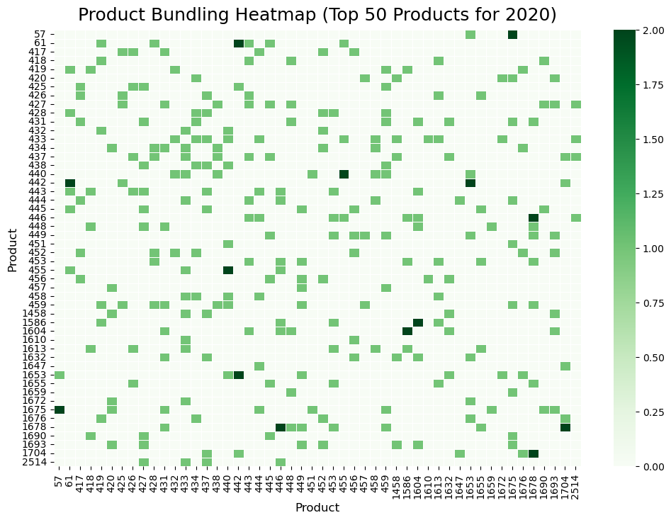

**Low Bundling Frequency = Missed Upselling Opportunities**
- Since no bundles were purchased more than twice, customers aren’t naturally buying these items together, which means:
  - There’s no strong association between certain products.
  - Customers may not realize these items go well together.
  - There may be barriers (e.g., pricing, lack of promotions).

**Most Bundles Were Purchased Only Once**
- The fact that most bundles were only bought together once suggests that the store has not optimized bundling strategies effectively.

**Top Bundle Pairs to Focus On**

The following bundles were bought together twice, meaning they have some demand:
   - **57 & 1675**:    WWI 1GB Digital Voice Recorder Pen E100 Black, MGS Hand Games men M300 Red

   - **61 & 442**:    WWI 2GB Spy Video Recorder Pen M300 Black, WWI Desktop PC1.80 E1801 Silver

   - **440 & 455**: WWI Desktop PC1.60 E1600 Silver, WWI Desktop PC2.33 X2330 White

   - **442 & 1653**: WWI Desktop PC1.80 E1801 Silver, Contoso DVD 7-Inch Player Portable E200 Silver

   - **1678 & 2514**: MGS Hand Games for Office worker L299 Red, Contoso Bluetooth Active Headphones L15 White

   - **1586 & 1604**: SV DVD 55DVD Storage Binder M56 Black, SV DVD 14-Inch Player Portable L100 Black


## 5. Recommendations
### 5.1. Sales Team

<u> Revenue Trends (2016-2020): Demand & Inventory Strategy</u>

- **Stock More Computers**: Computers have been the most resilient category, especially post-2018. Ensure enough supply to meet demand, particularly during peak months (February, May, and December).

- **Prepare for Seasonal Spikes**: Sales should anticipate higher demand in December (holiday sales), February (new product launches), and May (mid-year promotions). More aggressive sales efforts (e.g., bulk discounts, financing plans) should align with these cycles.

- **Manage April Sales Dips**: Since revenue drops near zero every April, use this period to offload old inventory at clearance prices before the May rebound.

- **Shift Focus Away from TV & Video**: Sales efforts should be redirected towards higher-growth categories like Computers, Cellphones, and Cameras, as TV & Video has been in decline since 2016.

<u>Online vs. Physical Store Revenue Trends (2016-2020)
: Revenue Optimization & Channel Strategy</u>

- **Adapt Sales Strategies to Channel Performance Trends**:
  - Since physical stores dominated in 2016-2017, but online revenue caught up by 2018, ensure that sales targets and strategies reflect the shift toward e-commerce.
  - In 2020, physical store revenue declined more sharply than online, meaning in-store sales teams should focus on upselling and cross-selling to maximize revenue per customer.

- **Address Seasonal Revenue Volatility**:
  - April consistently showed a revenue drop in both online and physical stores (worst in April 2018 for online stores at $0.4K).
  - To prevent April slowdowns, introduce pre-April sales incentives, such as limited-time discounts or extended warranties.
  - Leverage high-revenue months (December, February, May) by ensuring sufficient stock, optimizing staffing, and running targeted promotions.

- **Leverage Store-Specific Strengths**:
  - Physical stores should focus on experience-driven purchases (e.g., live product demos, in-store-only exclusives).
  - Online stores should prioritize fast delivery, easy returns, and bundle promotions to keep customers engaged.
  - Introduce flexible payment options (e.g., installment plans, financing) to sustain sales in both channels, especially during economic downturns (as seen in 2020).

<u>Exchange Rate & Sales Trends (2016-2020): Revenue Optimization & Market Expansion</u>

- **Expand U.S. & Online Sales Growth**
  - Allocate more inventory & resources to U.S. and Online channels.
  - Expand fulfillment centers & logistics partnerships to optimize delivery efficiency.
  - Negotiate better bulk pricing with suppliers for U.S. & Online-exclusive products.

- **Align Product Inventory with Regional Demand Cycles**
  - Stockpile high-demand products in Germany before peak seasons to maximize sales.
  - Distribute inventory more evenly in the UK to support stable year-round demand.
  - Develop a demand-based pricing strategy for Germany (discounts during low seasons).
  - Establish emergency stock reserves to handle future economic shocks.

- **Strengthen Sales Strategy in Mid-Tier Markets (Canada, UK, Germany)**
  - Standardize pricing strategies across these markets for consistency.
  - Bundle products strategically to increase order values.
  - Offer volume-based discounts to encourage bulk purchases.

- **Optimize Smaller Market Strategies (Australia, France, Italy, Netherlands)**
  - Focus on high-performing cities rather than full-country expansion.
  - Test localized pricing & product bundles to assess market potential.
  - Partner with regional distributors instead of large-scale direct sales.

- **Adjust Pricing Strategies Based on Exchange Rate Volatility**
  - Increase pricing flexibility in Australia to counter fluctuating exchange rates.
  - Use dynamic pricing models in the UK to protect profit margins.
  - Negotiate better supplier contracts in Europe to mitigate rising import costs.

<u>Country-Level Store & Customer Metrics (2020): Revenue Optimization & Market Expansion</u>

- **Strengthen U.S. & Online Sales Channels**
  - Expand U.S. store network and improve logistics to maintain market dominance.
  - Invest in e-commerce infrastructure to further scale Online sales.
  - Develop exclusive Online promotions to drive higher digital revenue.

- **Optimize Mid-Tier Markets (UK, Germany, Canada)**
  - Standardize pricing and promotions across these markets to drive consistent growth.
  - Introduce localized product bundles and volume discounts.
  - Increase marketing investment in high-performing regions like the UK to capture more market share.

- **Improve Market Penetration in Underperforming Regions (France, Italy, Netherlands)**
  - Shift focus to high-efficiency store locations rather than large-scale expansions.
  - Test pop-up stores or small-format locations before committing to full-scale investment.
  - Analyze product preferences in these countries and tailor inventory accordingly.

- **Increase Revenue per Square Meter in Low-Efficiency Markets (U.S., UK, Canada)**
  - Optimize store layouts to encourage upselling and impulse purchases.
  - Introduce click-and-collect options to drive additional foot traffic.
  - Close or repurpose low-performing store locations to maximize profitability.

- **Expand Store Space in High-Efficiency Markets (France, Netherlands)**    
  - Open additional stores in high-revenue-per-sqm regions to scale profitability.
  - Experiment with showroom-style stores to maximize revenue with minimal footprint.
  - Leverage store space for experiential marketing and community engagement.

<u>Customer Segmentation & Buying Patterns (2020): Revenue Optimization & Customer Retention</u>

- **Strengthen Retention Strategies for High-Spending Older Customers (56+)**
  - Develop personalized loyalty programs with exclusive discounts, early access to sales, and premium customer service.
  - Introduce targeted product bundles featuring best-selling items for this age group.
  - Offer flexible payment options (e.g., installment plans) to encourage larger purchases.

- **Optimize Product Pricing & Promotions for Price-Sensitive Younger Customers (18-25)**
  - Introduce budget-friendly product lines or entry-level versions of premium products.
  - Offer student discounts or limited-time promotions to attract younger buyers.
  - Bundle complementary products at lower price points to increase cart value.

- **Maintain a Balanced Inventory Strategy for Both Age Groups**
  - Ensure a strong mix of premium, high-margin products for older customers and affordable, entry-level items for younger shoppers.
  - Adjust product availability based on purchase patterns to optimize stock levels.
  - Promote seasonal discounts strategically to appeal to both customer segments.

<u>Customer Segmentation & Buying Patterns (2020): Revenue Optimization & Product Strategy</u>

- **Maximize Revenue from High-Value Older Customers (56+)**
  - Expand premium product offerings, especially in Computers, Cellphones, and Home Appliances, to cater to their spending habits.
  - Offer tailored upselling opportunities (e.g., extended warranties, premium accessories) for this segment.
  - Introduce VIP-tiered loyalty programs with exclusive benefits for repeat buyers in this age group.

- **Optimize Pricing & Discounts for Younger, Price-Sensitive Customers (18-25)**
  - Introduce budget-friendly product lines or financing options (e.g., buy now, pay later) to attract younger buyers.
  - Bundle lower-cost accessories (e.g., headphones with cellphones) to increase average transaction value.
  - Run student or first-time buyer promotions to build long-term brand loyalty.

- **Improve Sales Strategy for High-Volume, Low-Revenue Categories**
  - Adjust pricing strategies in Games & Toys, Music, Movies & Audiobooks to maximize profit margins.
  - Focus on limited-time exclusives or collector’s editions to justify higher price points.
  - Explore subscription models for digital entertainment to create recurring revenue.

- **Leverage High Customer Interest in Cellphones & Computers to Drive Additional Revenue**
  - Promote trade-in programs to encourage frequent upgrades in these categories.
  - Bundle software, accessories, or service plans to increase per-customer spending.
  - Use seasonal promotions (back-to-school, holiday deals) to boost large purchases.

<u>Regional Spending & Demographic Trends (2020): Revenue Optimization & Market Expansion</u>

- **Optimize Regional Pricing & Product Strategies for Gender-Based Spending Trends**
  - In France & Italy, introduce female-focused product bundles and marketing campaigns to maximize engagement.
  - Maintain gender-neutral strategies in the US, Canada, UK, and Germany since spending is balanced.
  - Expand premium product offerings in Australia, where female customers contribute more revenue.

- **Maximize Revenue from Older (56+) Consumers Across All Countries**
  - Prioritize high-margin products (e.g., Computers, Home Appliances) for this segment.
  - Offer premium service add-ons (extended warranties, setup assistance) to increase purchase value.
  - Introduce exclusive VIP-tiered loyalty programs for frequent, high-spending older customers.

- **Strengthen Mid-Tier Markets (UK, Canada, Germany) by Leveraging Strong Senior Spending**
  - Expand high-value product lines in these regions to capture senior spending power.
  - Offer flexible payment options (installments, financing) to encourage larger purchases.
  - Optimize store layouts to highlight best-selling products for this demographic.

- **Improve Performance in Low-Customer-Count Regions (Australia, France, Italy)**
  - Conduct localized demand analysis to identify gaps in product selection.
  - Offer region-specific promotions and discounts to drive higher engagement.
  - Test smaller-format or pop-up stores before committing to full-scale investment.

<u>Repeat vs. One-Time Buyers Before & After the Pandemic (2019-2020): Customer Retention & Revenue Stability</u>

- **Strengthen Retention Strategies to Reverse the Decline in Repeat Buyers**
  - Implement loyalty programs with tiered benefits to incentivize repeat purchases.
  - Offer exclusive perks (discounts, early access, personalized recommendations) to encourage multiple transactions.
  - Introduce "Next Purchase" discounts at checkout to increase repeat purchase rates.

- **Optimize Pricing & Promotions for One-Time Buyers to Convert Them into Repeat Customers**
  - Leverage targeted follow-up promotions (e.g., personalized email offers, bundle deals) for first-time buyers.
  - Implement a "first-time buyer discount" that includes a second-purchase incentive (e.g., "Get 10% off your next order").
  - Use product bundling strategies to increase initial order value and encourage brand engagement.

- **Address Brand Loyalty Erosion by Enhancing Customer Experience**
  - Improve post-purchase engagement through personalized communication (emails, app notifications, special deals).
  - Offer subscription-based models or membership programs to lock in recurring revenue.
  - Increase trust-building initiatives (customer testimonials, quality assurance guarantees) to rebuild loyalty.

<u>Repeat vs. One-Time Buyer Segmentation (2020): Customer Retention & Repeat Purchase Growth</u>

- **Reduce One-Time Buyer Drop-Off with Targeted Retention Offers**
  - Implement "second-purchase discounts" for first-time buyers to encourage repeat transactions.
  - Create bundle deals or loyalty perks for high-value product categories (Computers, Cellphones) to drive follow-up purchases.
  - Offer subscription models or extended warranties for products with low repeat purchase rates (TV & Video, Audio).

- **Prioritize Retention Strategies for High-Value Age Segments (56+)**
  - Introduce personalized follow-ups (emails, SMS, or calls) for high-spending senior buyers to build stronger brand loyalty.
  - Offer concierge services or post-purchase support (e.g., product setup assistance, troubleshooting guides) to increase engagement.
  - Design targeted retention campaigns for older buyers (56+) and mid-tier segments (26-45), as they have high initial engagement but low repeat purchase rates.

- **Improve Repeat Purchase Rates in Key Markets (US & Online Sales)**
  - Implement personalized recommendations for online buyers to increase repeat shopping behavior.
  - Introduce "frequent buyer rewards" (e.g., cashback, early access to new products) to drive customer loyalty.
  - Test regional retention campaigns in underperforming markets (France, Italy, Netherlands) to assess their potential for repeat sales.

<u>Revenue & Sales Volume by Category and Color (2020): Optimizing Product Inventory & Color Preferences</u>

- **Prioritize Black, White & Silver Computers in Inventory & Promotions**
  - Maintain high stock levels for Black & White Computers, as they are the top revenue drivers.
  - Expand marketing efforts around Silver Computers, as they perform well but lag behind Black & White.
  - Consider bundle deals or upsell strategies for Silver Computers to boost their revenue contribution.

- **Increase Supply & Promotion of High-Performing Colors in Key Categories**
  - Brown Cellphones & Computers are strong revenue drivers—ensure adequate stock and highlight them in promotions.
  - Silver TV & Video products perform well—consider premium positioning or exclusive deals to maximize sales.
  - Emphasize Black & Grey Cellphones & Cameras in mid-tier pricing strategies to sustain demand.

- **Phase Out or Limit Stock for Low-Demand Colors**
  - Reduce inventory for Gold Computers, Green Games & Toys, Pink Computers, Purple Home Appliances, and Transparent Cellphones, as they have poor sales and revenue.
  - If keeping these colors, reposition them as "limited edition" or "custom-order only" to avoid overstocking.

<u>Top-Performing Brands by Revenue & Sales Volume (2020): Optimizing Brand Performance & Inventory</u>

- **Prioritize Inventory & Promotions for Market-Leading Brands**
  - Wide World Importers Computers & Adventure Works Computers should receive top priority in stock management, as they are the highest revenue generators.
  - Ensure The Phone Company Cellphones & Fabrikam Cameras maintain consistent availability, as they are the top performers in their categories.
  - Negotiate better supplier deals with these brands to secure bulk purchasing discounts and improve profit margins.

- **Address the High-Volume, Low-Revenue Brands**
  - The Phone Company Cellphones & Tailspin Toys Games & Toys sell in large quantities but generate less revenue—consider strategic price adjustments or bundle deals to increase revenue per transaction.
  - If price increases are not feasible, optimize marketing spend to ensure high sales volume still yields profitability.

- **Expand Mid-Tier Brands with High Growth Potential**
  - Adventure Works TV & Video, Contoso Home Appliances, and Proseware Computers contribute significantly to revenue but remain below market leaders—invest in targeted promotions & competitive pricing to boost their performance.
  - Test regional sales strategies to see if demand for mid-tier brands varies across locations.

- **Reduce or Reposition Underperforming Brands**
  - Southridge Video Computers, Southridge Video Games & Toys, Wide World Importers Home Appliances, Litware & Northwind Traders Home Appliances have weak sales—limit stock replenishment to avoid inventory waste.
  - If maintaining these brands, consider repositioning them as budget or clearance options.

<u>Product Bundling Insights from Transaction Data: Upselling & Bundling Strategy</u>

- **Introduce Strategic Product Bundles to Increase Attach Rates**
  - Since no bundles were purchased more than twice, pre-packaged bundle deals should be introduced to encourage customers to buy complementary items together.
  - Test price discounts on bundle purchases (e.g., “Buy Together & Save 10%”) to lower potential price resistance.

- **Promote the Top Bundle Pairs That Show Some Demand**
  - Focus on the six bundle pairs that were purchased twice to see if demand can be expanded with proper marketing.
  - Offer category-specific bundles (e.g., “Tech Essentials” for PC & Accessories, “Entertainment Pack” for DVDs & Players).
  - Encourage in-store and online recommendations (e.g., “Customers who bought this also bought…”).

- **Identify Cross-Sell Opportunities Between Popular & Low-Selling Products**
  - Pair fast-selling items (e.g., WWI Desktop PCs) with lower-performing accessories to increase overall revenue.
  - Use bundle discounts to clear slow-moving stock, especially in categories with low demand.

### 5.2. Marketing Team
<u> Revenue Trends (2016-2020): Consumer Behavior & Promotions</u> 

- **Promote Computers & Remote Work Solutions**: Since Computers have dominated since 2018, marketing should push work-from-home and gaming setups, especially around February, May, and December.

- **Leverage Seasonal Buying Behavior**:
  - **December**: Holiday bundles, Black Friday & Christmas promotions.
  - **February**: New product launch campaigns (capitalize on post-holiday spending).
  - **May**: Mid-year sales & upgrade offers (position products as "refreshing your setup for the rest of the year").

- **Target Cellphones & Cameras for Growth**: These categories are growing steadily and overtook Home Appliances in 2019. Marketing should run social media, influencer, and photography-based campaigns to drive continued interest.

- **Reposition Home Appliances**: Since its growth plateaued after 2018, marketing should refresh brand messaging (e.g., smart home integrations, energy efficiency, or bundling with Computers for a "smart home office" setup).

- **Address Pandemic-Related Shifts**:
  - Emphasize the role of Computers in remote work & education.
  - Adapt messaging for TV & Video (e.g., positioning home entertainment as an alternative to travel or outings).

<u>Online vs. Physical Store Revenue Trends (2016-2020): Customer Engagement & Demand Generation</u>

- **Targeted Campaigns for Key Revenue Spikes**
  - Align digital and physical store promotions with peak months:
December (holiday shopping), February (new product launches), and May (mid-year sales & refresh cycles).
  - Boost online ad spend during high-demand periods to maximize visibility.
  - Encourage omnichannel shopping experiences (e.g., “Buy Online, Pick Up In-Store” promotions).

- **Data-Driven Personalization**
  - Since online revenue was slightly behind physical store revenue in 2016-2017 but caught up later, marketing should focus on further accelerating e-commerce growth.
  - Use AI-driven recommendations for online shoppers to boost average order value (AOV).
  - Implement retargeting ads for abandoned carts & past visitors.

- **Promote Online Shopping for Long-Term Stability**
  - E-commerce was more stable than physical stores in 2020, showing its resilience during economic downturns.
  - Invest in SEO, social media ads, and influencer partnerships to maintain online growth.
  - Introduce subscription models or loyalty programs to drive long-term customer retention.

<u>Exchange Rate & Sales Trends (2016-2020): Customer Acquisition & Retention Strategies</u>

- **Maximize U.S. & Online Sales Growth via Targeted Digital Campaigns [High-Growth Focus]**
  - Increase digital marketing investments (SEO, paid ads, influencer partnerships).
  - Launch exclusive online promotions & bundles to drive conversions.
  - Use retargeting ads for abandoned carts to boost online sales.

- **Localize UK & Germany Marketing Strategies**
  - For the UK: Focus on consistent, always-on marketing campaigns rather than seasonal promotions.
  - For Germany: Align marketing spend with peak seasonal demand periods.
  - Develop country-specific messaging for each region’s consumer behavior.

- **Improve Customer Retention via Loyalty Programs**
  - Launch targeted loyalty programs with rewards based on purchase frequency.
  - Offer early access to sales, exclusive discounts, or personalized recommendations.
  - Use email & SMS campaigns to re-engage past buyers.

- **Refine Pricing & Promotional Strategies for Smaller Markets**
  - Run A/B tests on regional pricing models to identify optimal price points.
  - Leverage geo-targeted promotions & discounts.
  - Analyze niche customer segments in these regions for tailored ad targeting.

- **Use Exchange Rate Data to Drive Region-Specific Promotions**
  - Offer localized discounts in weak-currency regions (UK) to counter rising prices.
  - Use promotions to stimulate demand in Europe where currency fluctuations may impact purchasing power.
  - Communicate price adjustments transparently to retain customer trust.

<u>Country-Level Store & Customer Metrics (2020): Customer Acquisition & Retention Strategies</u>

- **Boost Customer Acquisition in Mid-Tier & Underperforming Markets**
  - Launch targeted digital campaigns in France, Italy, and the Netherlands to increase awareness.
  - Develop region-specific loyalty programs to improve retention in low-customer-density markets.
  - Offer first-time buyer discounts to encourage trial in new and underperforming regions.

- **Drive Customer Engagement in High-Density Markets (France, Netherlands)**
  - Personalize marketing efforts based on high store efficiency, offering VIP experiences and priority access to new products.
  - Implement referral programs to capitalize on strong in-store engagement.
  - Strengthen local partnerships to enhance brand presence in these regions.

- **Use Data-Driven Insights to Optimize Promotional Strategies**
  - Tailor promotions based on customer density—high-density stores (France) should focus on in-store events, while low-density markets (Canada) should emphasize digital and direct-to-customer campaigns.
  - Offer limited-time regional discounts in countries with moderate store efficiency to stimulate demand.
  - Conduct localized A/B testing on advertising strategies to refine messaging and engagement.

- **Strengthen E-Commerce & Omni-Channel Strategies**
  - Align online promotions with physical store strategies to drive cross-channel engagement.
  - Offer personalized product recommendations based on customer location and past purchase history.
  - Improve mobile and social media advertising to increase conversion rates for Online shoppers.

- **Optimize Store Portfolio for Future Expansion**
  - Focus future store openings in countries with high revenue per sqm (France, Netherlands).
  - Reduce physical footprint in low-efficiency locations while strengthening digital presence.
  - Leverage temporary or pop-up stores to test new markets before making long-term investments.

<u>Customer Segmentation & Buying Patterns (2020): Customer Acquisition & Engagement</u>

- **Expand Digital & Social Media Marketing for Younger Customers (18-25)**
  - Leverage influencer marketing and social media ads to engage younger buyers.
  - Use gamified promotions (e.g., referral bonuses, giveaway contests) to drive engagement.
  - Highlight affordable, high-value products in targeted online campaigns.

- **Personalize Marketing for Older, High-Spending Customers (56+)**
  - Implement email marketing with product recommendations based on past purchases.
  - Offer exclusive VIP perks, such as early access to new product launches or loyalty-based rewards.
  - Create content that focuses on quality, durability, and premium product benefits.

- **Use Gender-Neutral Marketing Strategies to Maximize Reach**
  - Since gender-based spending differences are minimal, focus on universal messaging.
  - Promote products based on lifestyle and needs rather than gender stereotypes.
  - Use customer testimonials and reviews to appeal to a broad audience.

<u>Customer Segmentation & Buying Patterns (2020): Customer Acquisition & Engagement</u>

- **Prioritize Targeted Campaigns Based on Age Segments**
  - For older customers (56+): Highlight product reliability, premium features, and long-term value.
  - For younger customers (18-25): Use influencer marketing, social media promotions, and interactive content to engage them.
  - Avoid gender-based marketing, as spending behaviors are similar across demographics.

- **Boost Engagement in High-Interest, Low-Revenue Categories (Games, Music, Movies, Audiobooks)**
  - Implement gamification strategies (e.g., loyalty points, achievement-based rewards) to encourage repeat purchases.
  - Cross-promote these categories with complementary products (e.g., bundle gaming accessories with laptops).
  - Offer subscription-based services for digital media to increase long-term value.

- **Improve Customer Lifetime Value for High-Volume Buyers**
  - Use personalized recommendations based on past purchases to drive repeat business.
  - Offer exclusive deals for returning customers in high-volume categories.
  - Introduce tiered loyalty benefits that reward both frequent and high-value purchases.

<u>Regional Spending & Demographic Trends (2020): Customer Acquisition & Engagement</u>

- **Localize Marketing Strategies for Gender-Based Spending Variations**
  - In France & Italy, develop campaigns targeting female buyers, emphasizing product aesthetics, functionality, and premium service.
  - In other regions (US, UK, Germany, Canada), maintain balanced messaging as gender-based spending is minimal.
  - Use social media and influencer marketing in female-dominated regions to drive engagement.

- **Prioritize Age-Based Targeting Over Gender-Based Strategies**
  - Since older customers (56+) are the top spenders everywhere, tailor campaigns around quality, reliability, and long-term value.
  - For younger demographics (18-25), emphasize affordability, financing options, and tech-forward features.
  - Adjust digital ad placements to align with age group preferences (social media for younger buyers, email & traditional ads for older buyers).

- **Strengthen Brand Presence in Low-Customer Regions (Australia, France, Italy)**
  - Increase digital marketing investment in these countries to build awareness.
  - Offer first-time purchase incentives or referral programs to accelerate acquisition.
  - Leverage localized influencer partnerships to boost visibility.

- **Capitalize on Germany’s Balanced Customer Distribution (26-45 Growth Segment)**
  - Germany has stronger spending in younger age groups than other European countries—invest in more youth-oriented promotions.
  - Launch exclusive limited-time offers for younger demographics to drive urgency.
  - Use event-based marketing (e.g., tech expos, trade shows) to engage 26-45 buyers in Germany.

<u>Repeat vs. One-Time Buyers Before & After the Pandemic (2019-2020): Customer Engagement & Brand Loyalty</u>

- **Re-Engage Lost Frequent & Loyal Buyers with Targeted Campaigns**
  - Identify past frequent buyers and send personalized win-back offers (e.g., "We Miss You – Special Discount Inside!").
  - Create exclusive VIP programs for high-value customers to reward long-term engagement.
  - Utilize retargeting ads and personalized recommendations to keep the brand top-of-mind.

- **Convert One-Time Buyers into Loyal Customers Through Post-Purchase Engagement**
  - Follow up immediately after purchase with tailored product recommendations and discounts for future purchases.
  - Offer time-sensitive incentives (e.g., "Limited 20% off your next order – Expires in 7 Days").
  - Use gamification strategies (e.g., milestone rewards, purchase streak bonuses) to encourage continued shopping.

- **Adapt to Post-Pandemic Shopping Behavior with Hybrid Online & Offline Strategies**
  - Enhance the omnichannel experience by integrating online and in-store shopping incentives (e.g., online exclusives, in-store pickup discounts).
  - Offer subscription models or auto-replenishment for frequently purchased items.
  - Invest in content marketing and social proof (customer reviews, influencer partnerships) to rebuild trust and engagement.

<u>Repeat vs. One-Time Buyer Segmentation (2020): Customer Engagement & Lifecycle Marketing</u>

- **Strengthen Gender-Specific Engagement Strategies**
  - Since female buyers dominate one-time purchases, create tailored retention offers with product recommendations based on purchase history.
  - Use email and social media remarketing for female customers to drive re-engagement.
  - Launch gender-neutral loyalty campaigns, as male buyers likely follow a similar one-time purchase trend.

- **Create Product-Specific Retention Campaigns**
  - Focus retention efforts on Computers & Cellphones, as they have high one-time buyers but low repeat purchases.
  - Introduce trade-in programs or upgrade incentives for customers in the TV & Video and Audio categories.
  - Develop content marketing (guides, tutorials, webinars) to keep customers engaged beyond their first purchase.

- **Strengthen Retention in Low-Engagement Markets (France, Italy, Netherlands)**
  - Invest in localized marketing campaigns that emphasize brand trust, exclusive offers, and long-term value.
  - Offer country-specific promotions and first-time buyer incentives to improve customer lifecycle value.
  - Use customer feedback surveys to understand why repeat engagement is low in these regions and adjust strategies accordingly.

<u>Revenue & Sales Volume by Category and Color (2020): Aligning Color Preferences with Consumer Demand</u>

- **Leverage Consumer Color Preferences in Product Advertising**
  - Highlight Black, White, and Silver Computers in marketing campaigns, as these are the top-selling colors.
  - Position Brown Cellphones & Silver TV & Video products as premium or high-quality options.
  - Avoid emphasizing low-demand colors (Pink, Transparent, Green) in mainstream advertising.

- **Use Data-Driven Pricing & Promotion for High-Volume, Low-Revenue Colors**
  - Black Cellphones sell in high volumes but generate lower revenue—test pricing adjustments or upsell with accessories.
  - Black Music, Movies & Audiobooks have high sales but low revenue—consider subscription models or bulk purchase incentives.
  - Explore targeted promotions for low-revenue colors to clear inventory efficiently.

- **Test Regional & Demographic Preferences for Color Variants**
  - Conduct regional A/B testing to see if color preferences vary by country or demographic.
  - If a specific region shows demand for an underperforming color, localize stock distribution accordingly.
  - Offer customization or limited-edition runs for niche colors to test market interest before committing to mass production.

<u>Top-Performing Brands by Revenue & Sales Volume (2020): Brand Positioning & Targeted Promotions</u>

- **Strengthen Brand Awareness for High-Performing Categories**
  - Feature Wide World Importers, Adventure Works & The Phone Company prominently in advertising campaigns to reinforce their dominance in Computers & Cellphones.
  - Highlight Fabrikam Cameras as the premium choice in the camera segment.
  - Use brand-driven promotions (e.g., "Best-Selling Brands Month") to maximize exposure for top-tier brands.

- **Implement Pricing & Upsell Strategies for High-Volume, Low-Revenue Brands**
  - Tailspin Toys Games & Toys & The Phone Company Cellphones should be marketed with bundles, accessories, or loyalty rewards to increase revenue per sale.
  - Use limited-time price hikes on high-demand products to test customer willingness to pay slightly more.

- **Differentiate & Boost Mid-Tier Brands**
  - Promote Adventure Works TV & Video, Contoso Home Appliances, and Proseware Computers as "hidden gems" to encourage consumer interest.
  - Offer category-based promotions (e.g., "Upgrade Your Home: Best Home Appliance Deals") to drive demand for mid-tier brands.

- **Reassess & Optimize Marketing Spend for Low-Performing Brands**
  - Reduce marketing investment in Southridge Video, Wide World Importers Home Appliances, and Litware & Northwind Traders, as they underperform across revenue & sales.
  - If keeping these brands, position them as budget-friendly options rather than investing in high-cost marketing campaigns.

<u>Product Bundling Insights from Transaction Data: Driving Awareness & Encouraging Bundle Sales</u>

- **Make Bundles Visible & Attractive to Customers**
  - Highlight bundled savings on product pages, checkout screens, and in-store displays to ensure customers are aware of the deals.
  - Use personalized recommendations (e.g., “Complete Your Setup” for PC bundles, “Entertainment Bundle” for DVD players & accessories).

- **Run Promotional Campaigns to Build Stronger Product Associations**
  - If customers don’t naturally buy these items together, create campaigns showcasing their value (e.g., “Get the Ultimate Work-From-Home Setup”).
  - Consider seasonal or event-based bundles (e.g., “Back-to-School Laptop & Accessories Pack,” “Holiday Gaming Bundle”).

- **Optimize Pricing & Test Discounts to Encourage Bundling**
  - Test different discount levels (5%, 10%, 15%) on bundles to see which pricing structure leads to the highest sales uplift.
  - Offer limited-time bundle deals to drive urgency and test demand.


## 6. Clarifying Questions: Assumptions and Caveats

### 6.1. Questions to Stakeholders Prior to Project Advancement
- **Missing Delivery Date Information**: Out of 62,884 entries in the ```Delivery Date``` column of the Sales table, 49,719 are blank. The 13,165 available values all belong to ```StoreKey = 0```, which corresponds to online sales.
  - Does this indicate that physical stores do not offer delivery services, or is the data incomplete?

- **Online Store Location Ambiguity**: The ```Country``` column in the Stores table is labeled as ```"Online"``` for the online store(s) instead of specifying a country location.
  - Does this dataset represent a single online store or multiple online stores?

- **Merging Exchange Rates with Sales Data**: The Exchange_Rates table lacks a unique key to directly match with the Sales table.
  - Should the tables be merged using ```Order Date```(Sales) and ```Date``` (Exchange_Rates), assuming we want exchange rates as per the date of the sale?

- **Calculating Customer Age and Store Age at the Time of Sale**:
The Customers table contains a ```Birthday column```, and the Stores table contains an ```Open Date``` column.
  - Should ```Customer Age``` and ```Store Age``` be calculated based on the ```Order Date``` (rather than the current date) to reflect their age at the time of the purchase?

### 6.2. Assumptions and Caveats
**Missing Data for Online Store Size**: 
- The ```Square Meters``` column in the Stores table is empty for ```StoreKey = 0```.
- As a result, it was not possible to compare the market efficiency of the online store with physical stores that have area values.

**Stock Availability Data is Missing**: 
- The dataset does not include stock levels, making it unclear whether:
  - Certain colors or brands sold poorly due to low demand or
  - If they simply had lower stock availability compared to higher-selling options.

**No Discount or Promotion Data**:
- The dataset does not include information on discounts, promotions, or bundled pricing, which could have influenced purchasing decisions.
- Sales performance may not fully reflect customer preferences, as discounts could have skewed demand.

**Lack of Information on Loyalty Programs & Repeat Customers**:
- The dataset does not indicate whether repeat customers are part of a loyalty program or if any incentives influenced their purchases.
- Customer retention analysis is based solely on purchase frequency, without insights into potential loyalty-driven behavior.

**Online vs. Physical Store Comparison Uses Average Revenue**:
- Since there is only one online store compared to multiple physical stores across different countries, revenue comparisons were made using average revenue per store rather than absolute totals.
- This assumes the online store is comparable to a physical store, though online sales dynamics may differ.

**Outlier Handling Varies by Category**:
- Outliers were reviewed on a category-specific basis using appropriate statistical methods (e.g., IQR, log + IQR, z-score) and business logic.
- Legitimate high-value products (e.g., luxury cameras, large TVs) were retained with documentation.
- One pricing anomaly (a $198 game) was corrected by replacing it with the median for its subcategory.

**Category Misclassifications Were Corrected**:
- Case fans listed under “Home Appliances” were reclassified as “Computer Accessories” under the “Computers” category based on stakeholder input.

**Bundling, Loyalty, and Cross-Sell Opportunities May Be Understated**:
- Without promotional tagging or product bundles metadata, bundling analysis relied solely on co-purchase behavior.

## 7. Code & Technical Implementation
This section outlines the technical steps taken to process and analyze the dataset, including the tools, libraries, and methods used for data cleaning, transformation, and visualization. 

### 7.1. Tools & Libraries Used

The following Python libraries were used throughout the analysis:

- **pandas**: For data manipulation and cleaning (loading, merging, filtering, etc.)
- **numpy**: For numerical operations, handling missing values, and performing mathematical functions
- **matplotlib** & **seaborn**: For creating static visualizations such as line graphs, bar charts, and heatmaps
- **plotly**: For interactive visualizations like scatter plots and bubble charts

The implementation was done in a **Jupyter Notebook** (`.ipynb`) within **VS Code**. 
To view the notebook with the full code, [click here](voltedge_electronics_code.ipynb).

### 7.2. Data Loading & Merging
The dataset consists of five tables spanning **2016-2020**:

- ```Customers```
- ```Products```
- ```Sales```
- ```Stores```
- ```Exchange_Rates```

Each table was loaded using the `pandas.read_csv()` method. The tables were merged based on common keys, allowing for an integrated dataset.

The merging steps are as follows:

- **Customers** table was merged with the **Sales** table on ```CustomerKey```
- **Products** table was merged with the **Sales** table on ```ProductKey```
- **Stores** table was merged with the **Sales** table on ```StoreKey```
- **Exchange_Rates** table was merged with the **Sales** table on the ```Date``` (from Exchange Rates) and ```Order Date``` (from Sales), assuming exchange rates apply to the day the sale was made/paid.

This resulted in a comprehensive dataset, combining information from all five tables, which could then be used for analysis.

### 7.3. Data Cleaning & Preprocessing

**Customers Table**
- Converted ```Birthday``` column from object type to `datetime` for age calculations.
- Addressed missing values in the ```State Code``` column (10 null values). These missing values were filled by:
  1. Creating a mapping of state names to state codes.
  2. Replacing missing values with the corresponding state code for Napoli in Italy, which was missing from the dataset.
-  Verified uniqueness of ```CustomerKey``` using ```.is_unique``` — no duplicates found.
- Checked for duplicate rows using ```.duplicated().sum()``` — none detected.
- No numerical columns present for outlier detection.

**Sales Table**
- Converted ```Order Date``` and ```Delivery Date``` columns from object type to `datetime`.
- **49719 missing delivery dates** were identified:
  - Since only **```StoreKey``` 0 (Online Store)** had delivery date values, an average delivery time of 4 days and 12 hours was computed.
  - For physical stores (other than StoreKey 0), I assumed no delivery was needed, and thus the ```Delivery Date``` column for these stores was left as `null` (or replaced as "Nat" for "Not Applicable").
  - Removed the derived ```Delivery Time``` column for physical stores.
- Verified no duplicate rows and no repeated ```Order Number``` + ```Line Item``` combos.
- Detected right-skewed quantity distribution (skew = 1.12). IQR method revealed 1,808 high-quantity records (values = 9 or 10). Given the nature of bulk orders, no action was taken.
- After cleaning, the dataset was merged as mentioned above.

**Exchange_Rates Table**
- Converted the ```Date``` column from object type to `datetime` for accurate date comparisons and merging with the sales data.
- No duplicates found.
- Used ```.describe()``` and IQR to confirm no outliers in exchange rates (range 0.63–1.73). Distribution is realistic across global currencies.

**Products Table**
- Cleaned ```Unit Cost USD``` and ```Unit Price USD``` columns by removing dollar symbols (`$`) and commas (`,`), and then converted these values to `float` type for mathematical operations.
- Verified ```ProductKey``` and ```Product Name``` were unique; no duplicates.
- Outliers analyzed and treated using category-specific methods:

    - **Download Games**: $198.39 entry replaced with subcategory median ($21.92).

    - **Home Appliances**: Case fans incorrectly classified were reassigned to "Computers" → "Computer Accessories".

    - **Computers**: Used log+IQR method; retained $0.95 cables but flagged category mixing in report.

    - **TV & Video**: Retained valid premium TVs and DVD box sets as accurate high/low values.

    - **Cameras**: Investigated outliers by brand and validated luxury/premium pricing with stakeholders.

- All other categories had outliers reviewed and either retained or corrected based on business logic and stakeholder input.

**Stores Table**
- Converted ```Open Date``` to `datetime` to calculate the age of stores.
- Found that ```Square Meters``` was missing for **```StoreKey``` 0 (Online Store)**. Replaced this missing value with a `0` for **0 m²**.
- Verified uniqueness of ```StoreKey```; no duplicates found.
- Used z-score method on ```Square Meters``` (skew = -0.55); no outliers detected.

### 7.4. Feature Engineering

The following new columns were created to aid in analysis and to make the dataset more insightful:

- **Order Month & Order Year**: Extracted from the ```Order Date``` column.
- **Revenue**: Calculated as the product of ```Quantity``` and ```Unit Price USD``` (```Revenue = Quantity * Unit Price USD```).
- **Customer Age**: Derived by subtracting ```Birthday``` from ```Order Date```.
- **Store Age**: Derived by subtracting ```Open Date``` from ```Order Date```.
- **Store Type**: Categorical column created based on ```StoreKey``` (Online vs. Physical).

Additionally, the following columns were renamed for clarity and consistency:

- ```State_x``` → ```Customer State```
- ```State_y``` → ```Store State```
- ```Country_x``` → ```Customer Country```
- ```Country_y``` → ```Store Country```
- ```Exchange``` → ```Exchange Rate```
- ```CustomerKey``` → ```Customer Key```
- ```StoreKey``` → ```Store Key```
- ```ProductKey``` → ```Product Key```
- ```CategoryKey``` → ```Category Key```
- ```SubcategoryKey``` → ```Subcategory Key```
- ```Name``` → ```Customer Name```
- ```City``` → ```Customer City```
- ```State Code``` → ```Customer State Code```
- ```Zip Code``` → ```Customer Zip Code```
- ```Continent``` → ```Customer Continent```
- ```Birthday``` → ```Customer Birthday```

<br>

- **Outlier Flags**: Temporary flags were added during analysis to isolate pricing anomalies.
- **Corrected Category Assignments**: Category/subcategory fields were updated for misclassified items (e.g., case fans).
- **Skewness Columns**: Temporary columns like ```log_price``` were created for log transformation of skewed data.

<br>

- Finally, duplicate columns were removed after merging, such as the ```Currency Code``` column, which was redundant.

### 7.5. Data Analysis and Visualization

**Graphs Produced**

The following visualizations were generated to analyze various aspects of the dataset:

1. **Revenue Growth by Product Category (2016-2020)**: Line graph depicting the revenue trend by product category across months and years.

2. **Online vs. Physical Store Revenue (2016-2020)**:  
   - Line graph showing average revenue by store type (Online vs. Physical).  
   - Area graph showing the distribution of revenue by store type.

3. **Revenue & Sales Volume by Category and Color (2020)**: Heatmap showing the distribution of revenue and sales volume for product categories and colors.

4. **Revenue & Sales Volume by Category and Brand (2020)**: Heatmap showing the distribution of revenue and sales volume for product categories and brands.

5. **Revenue and Exchange Rate Trends by Country (2016-2020)**:  
   - Line chart displaying revenue trends by country.  
   - Line chart showing exchange rate trends by country.

6. **Revenue Distribution by Age and Gender (2020)**: Heatmap showing revenue distribution across different gender and age groups.

7. **Customer and Revenue Statistics by Country (2020)**: Horizontal bar charts comparing total revenue, total customers, revenue per square meter, customers per square meter, total store area, and total stores for each country.

8. **Gender and Age-Based Revenue Trends Across Countries (2020)**: Bubble charts showing customer distribution by gender and age group, and corresponding revenue trends across countries.

9. **Buyer Category Analysis (2019-2020)**: Bar charts comparing revenue and customer percentages for repeat buyers, frequent buyers, loyal buyers, and one-time buyers.

10. **Customer Segmentation for Repeat vs One-Time Buyers (2020)**: Heatmap showing customer segmentation by buyer category across key demographics such as gender, age group, country, and product category.

11. **Product Bundling Insights (2020)**: Heatmap displaying the frequency of product bundles purchased together.

<br>

**Technical Considerations**

For visualizations:
- **Subplots** were used to present multiple visualizations together for easier comparison (e.g., revenue and sales volume heatmaps, gender-based trends).
- **Interactive visualizations** (using Plotly) were created for deeper exploration, especially for customer distribution and revenue trends across countries and demographics.
- All graphs were labeled appropriately with titles, axis labels, and legends to improve clarity.

### 7.6. Code Organization and Structure

The entire analysis, from data cleaning to final visualizations, was performed in a Jupyter Notebook. The notebook contains detailed code, comments, and markdown cells to explain the steps taken. It is organized as follows::
1. **Import Libraries**: All relevant libraries were imported as one block of code.

2. **Data Loading**: The initial section of the notebook loaded all CSV files into Pandas DataFrames, with subsequent merges to create a unified dataset.

3. **Data Exploration**: All tables were reviewed for incorrect data types, column names, and missing values to identify necessary data cleaning steps and determine which columns needed to be added or calculated for feature engineering.

4. **Data Cleaning**: The next section performed data cleaning, including converting column types, handling missing values, and applying necessary transformations.

5. **Data Manipulation**: All tables were merged and features like customer age, store age, revenue, and new categorical columns were added to enrich the dataset.

6. **Aggregation & Visualization**: After cleaning and merging the data, various visualizations were created to analyze and communicate key insights from the dataset.


## License

This project is licensed under the Creative Commons Attribution-NonCommercial 4.0 International License (CC BY-NC 4.0).  
You may use, share, and adapt the work for non-commercial purposes, provided you give appropriate credit.

[View the full license](https://creativecommons.org/licenses/by-nc/4.0/)


